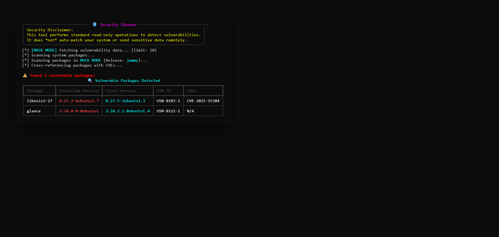
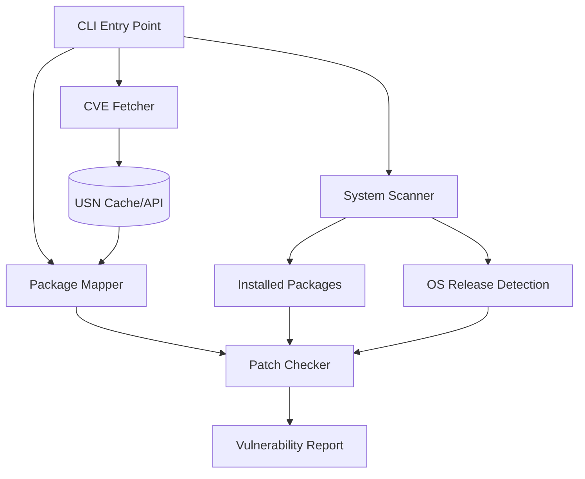

# 🛡️ Ubuntu Vulnerability Tracker

A professional, read-only security auditing tool designed to detect unpatched vulnerabilities on Ubuntu systems by cross-referencing installed packages with the official **Ubuntu Security Notices (USN)** database.



## 🌟 Key Features

- **Real-Time Auditing**: Fetches the latest security notices directly from Ubuntu's security API.
- **Release-Aware Scanning**: Automatically detects your Ubuntu release (`jammy`, `focal`, etc.) to provide accurate, relevant results.
- **Mock Mode**: Evaluate the tool on any OS (Windows/Mac) using built-in simulated data.
- **External List Support**: Audit remote or offline systems by scanning exported package lists (`--input-file`).
- **Premium CLI Experience**: Powered by `rich` for beautiful tables, status panels, and clear progress indicators.
- **Read-Only & Secure**: No system changes, no sensitive data transmission.

## 🏗️ Architecture



## 🚀 Quick Start

### 1. Prerequisites
- Python 3.8+
- (Native) Ubuntu/Debian system for local scanning

### 2. Installation
```bash
git clone https://github.com/kunal-1207/ubuntu_vuln_tracker.git
cd ubuntu_vuln_tracker
pip install -r requirements.txt
```

### 3. Usage Examples

**Scan current system (Ubuntu only):**
```bash
python cli.py
```

**Run in Mock Mode (Evaluate on Windows/Mac):**
```bash
python cli.py --mock --limit 50
```

**Scan a package list from another system:**
```bash
python cli.py --input-file my_packages.txt --release focal
```

## 🐳 Docker Support

Run the tracker in a consistent Linux environment regardless of your host OS:

```bash
docker build -t vuln-tracker .
docker run --rm vuln-tracker
```

## 🛠️ Tech Stack

- **Python**: Core logic
- **Rich**: Terminal UI/UX
- **Packaging**: Robust version comparison
- **Pytest**: Automated verification suite

---
*Developed for professional security auditing and system hardening.*
